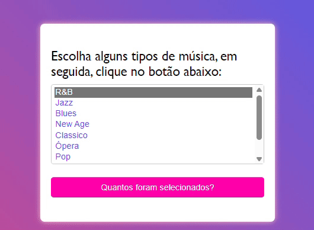

# Laços e Iterações
    
Este é um exemplo simples de HTML, JavaScript e CSS que demonstra o uso de laços e iterações. Realizado com o objetivo de realizar repetidas vezes uma determinada ação. 

 ## Funcionalidade

Este código cria um formulário onde os usuários podem selecionar vários tipos de música em uma lista suspensa. Ao clicar no botão "Quantos foram selecionados?", um alerta é exibido mostrando o número de opções selecionadas na lista suspensa.

# Mais

* [Como-Usar](#Como-Usar)

* [Detalhes-da-atividade](#Detalhes-da-atividade)

* [Tecnologias-utilizadas](#tecnologias-utilizadas)

* [Autores](#autores)

* [Detalhes](#detalhes)

# Como Usar

1. Abra o arquivo HTML em qualquer navegador da web.
2. Selecione os tipos de música desejados na lista suspensa.
3. Clique no botão "Quantos foram selecionados?".
4. Um alerta será exibido mostrando o número de opções selecionadas na lista.

## Detalhes da atividade 🔵

 Foi usado um código pronto da internet para esse atividade, link abaixo.

 [mozilla](https://developer.mozilla.org/pt-BR/docs/Web/JavaScript/Guide/Loops_and_iteration)

#### PROJETO (SOLUÇÃO): 

Quando selecionado além de uma musica aparce um alert.

# Tecnologias Utilizadas

◽ HTML 5
◽CSS3
◽JavaScript
◽GitHub
◽Visual Studio Code
◽Mozilla

## Autores 
-Sarah

